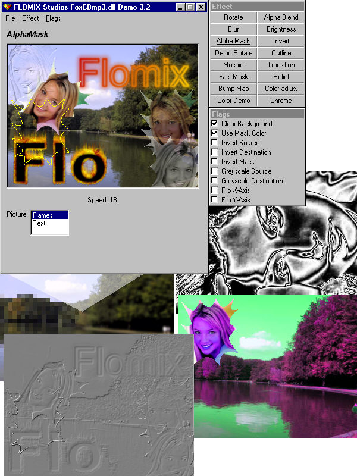



## Advanced Graphics Routines 3\.2 UPDATED  \*\*must see\!\*\*

### Description

Advanced Graphics Routines 3.2 is a Powerful, extremely fast collection of graphic routines that matches industrial standards. I wrote the main code in a C++ - dll, though it would be theoretically possible to write all the Code in pure VB, but VB is just to slow; this way is easier to use and much faster. 

 

This is a Completely Updated Version of the very successful, contest-winning predecessor, I improved all old functions and added many new ones. 

 

UPDATE 3.2 (3/6/2001): 

- New functions (listed below) 

- Increased readability of code 

- Improved GUI 

 

List of Graphical Functions: 

- Chrome (new 3.2)</b> 

- Aluminium (new 3.2) 

- Hue rotation (new 3.2) 

- Saturation Adjustment (new 3.2) 

- Contrast Adjustment (new 3.2) 

- Brightness Adjustment (fixed 3.2) 

- Alpha Mask (new 3.0) 

- Mosaic Filter (new 3.0) 

- Relief (new 3.0) 

- Blur (new 3.0) 

- Invert (new 3.0) 

- Outline (new 3.0) 

- Flip (new 3.0) 

- New Masked Draw (new 3.0) 

- AlphaBlending 

- Bump Mapping 

- Rotating 

- Anti-Aliasing 

 

All functions can be controlled by these Parameters: 

- FlipX/Y 

- Invert 

- Greyscale 

- Use Mask Color 

- Anti-Alias 

 

 

The effects are realtime even for large pictures like 640x480. 

Furthermore the new package contains some useful TIMER/COUNTER functions, that are very useful for example for realtime-programming. 

I included some easy samples in VB and a complete VB-Demo to show all the possibilities of the library. 

 

I hope you like the product, and if so *please* vote for this really useful and extremely fast code! Feedback would be appreciated, too. 

 

Sincerely, Florian Egel 

 

There are lately some download problems, but if there are problems you can get the file at 

 

http://www.flomix.de/download/foxcbmp32.zip

 

Additionally, you find the source code in C++ and a VB-only version here:

 

http://www.flomix.de/download/foxcbmp_src.zip
 
### More Info
 

             |
---                |---
**Submitted On**   |2001-04-07 15:33:38
**By**             |[Florian Egel](https://github.com/Planet-Source-Code/PSCIndex/blob/master/ByAuthor/florian-egel.md)
**Level**          |Intermediate
**User Rating**    |5.0 (929 globes from 187 users)
**Compatibility**  |VB 4\.0 \(32\-bit\), VB 5\.0, VB 6\.0
**Category**       |[Graphics](https://github.com/Planet-Source-Code/PSCIndex/blob/master/ByCategory/graphics__1-46.md)
**World**          |[Visual Basic](https://github.com/Planet-Source-Code/PSCIndex/blob/master/ByWorld/visual-basic.md)
**Archive File**   |[Advanced G181694102001\.zip](https://github.com/Planet-Source-Code/florian-egel-advanced-graphics-routines-3-2-updated-must-see__1-21470/archive/master.zip)

